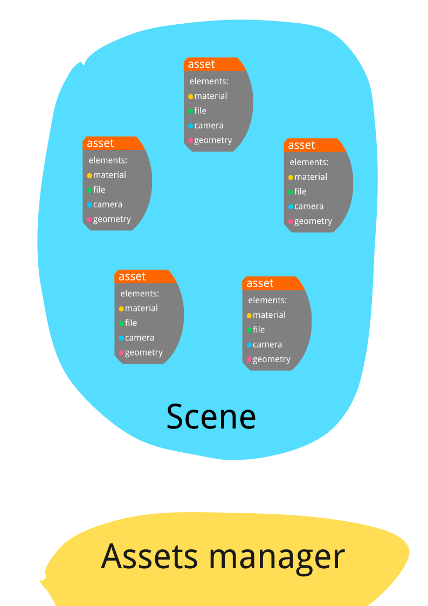

# Assets manager

A system for describing and managing assets for computer graphics.

Each scene (shot or sequence) consists of assets that contain elements. 
Elements are geometry, materials, textures, image files, data files, etc.

Two base classes Scene and Asset and many classes for Elements.
